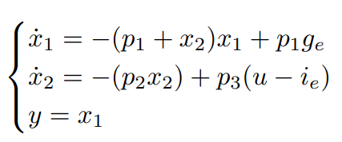

# Blood glucose control system
## Introduction
This is a project work that I developed, with the support of a team, for the MSc Computer Engineering course of Advanced Controls at University of Salerno, Italy.

The objectives of the project are:
- Evaluate the performance of a controller already provided, for the regulation of blood glucose levels in a diabetic patient;
- Develop alternative controllers based on more advanced linear and nonlinear control techniques;
- Critically analyze the performance of the proposed controllers to propose the final solution.
The mathematical model of the glucose-insulin system is provided.

In this project work the controllers designed are:
- State feedback controller implemented with the techniques of pole placement, Linear Quadratic Regulator (LQR) and Linear Quadratic Integral (LQI);
- State feedback controller with state observer;
- Feedback linearization controller;
- Gain scheduling controller.

In order to design the proposed controllers and analyze their performances, several techniques were employed:
- Phase Plane;
- Root Locus;
- Bode and Nyquist diagrams;
- Pole placement.

For each controller, the performance is evaluated in terms of settling time, overshoot, and tracking of references.

All of this was accomplished with Matlab and Simulink.

## Project structure
The project is organized into work packages, each of them representing a different task. Specifically:
- WP1: Analysis of the system and identification of the limitations the controller v0, already provided. The controller is based on state feedback on a linearized system around an equilibrium point.

- WP2: Design a new controller, v1, which is still linear but improves the performance of the closed loop (highlighting rise time, settling time, over-elongation). Then evaluate the controller obtained (r(t) = 0.0451);

- WP3: Design a state observer for the variable $x_2$ in order to use the controller v1 even when $x_2$ cannot be measured directly; 

- WP4: Design a new nonlinear controller v2, based on Feedback Linearization. Evaluate the controller and compare its performance with v1. Design an extension of the controller to chase time-varying references;

- WP5: Design a new nonlinear controller v3, based on Gain Scheduling. Evaluate the controller and compare its performance with v2. Provide simulation diagrams for time-varying references.

## Dynamical model
The dynamic system is described as follows:

Where the parameters have the following meanings:
- $p_1 = 0.0151 min^{-1}$ is the rate of glucose removal from the blood independently of the level of insulin;
- $p_2 = 0.0313 min^{-1}$ the rate of glucose removal given by the action of insulin; 
- $p_3 = 0.0097 l/(min^2 U)$ the uptake capacity given by insulin;
- $g_e = 0.97 g/l$ the equilibrium values of glucose;
- $i_e = 0.003 U/l$ the equilibrium values of insulin;

The state variables are:
- $x_1$: Blood glucose concentration, measured in $g/l$.
- $x_2$: Insulin concentration in interstitial fluids measured in $min^{-1}$. The concentration of insulin in the interstitial fluids influences the concentration of glucose in the blood $x_1$ because thanks to insulin, the cells recall glucose into the blood and thus $x_1$ is lowered.

The control input u(t) is the insulin present in the blood, measured in U/l. The concentration of insulin in the blood influences the concentration of insulin in the interstitial fluids $x_2$. Insulin is injected into the blood and then passes to the interstitial fluids.

## Implementation details
It was chosen to implement the project in Matlab and Simulink. The choice of Matlab is because it is a widely used tool for control systems and provides many useful functions and tools for implementing controllers and analyzing the system. The controllers are implemented as Simulink blocks, so they can be easily integrated into the simulation environment. As can be seen, the division of folders follows that of the work packages, so one folder for each work package. The following files are provided for each WP:
- WPX.mlx: The commented live script that runs the simulation and plots the results (comments are only available in Italian);
- XXX.slx: the Simulink model of the controllers.

Note that multiple controllers have been implemented for each WP, so that the performance of different controllers within the same WP can be compared and the best controller in each WP can be compared with the best controller in the other WPs.